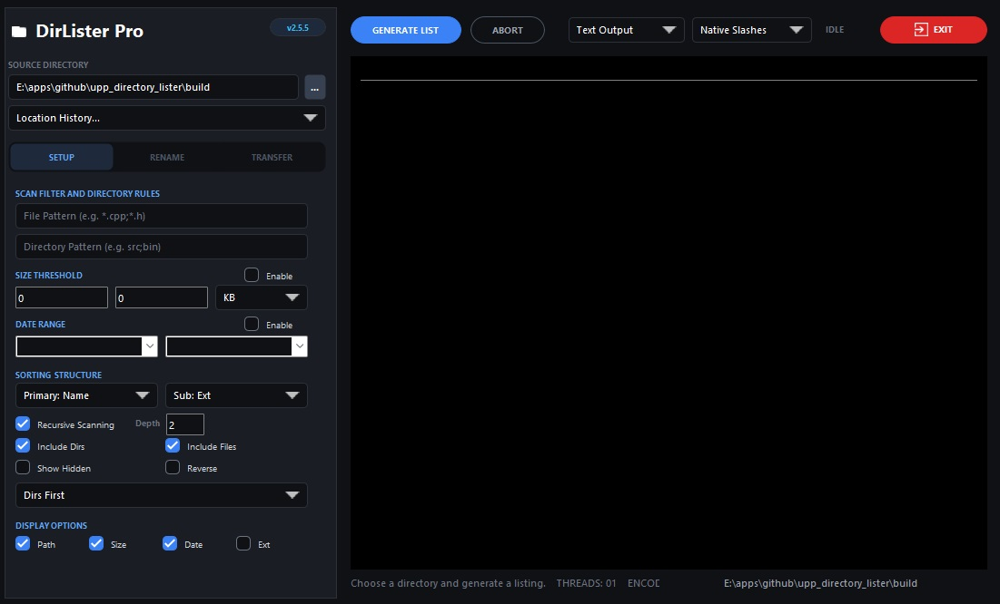

# DirLister

DirLister is a U++ desktop tool for scanning a directory, filtering and sorting the result, applying batch rename rules, transferring/copying matching files, and exporting the final listing as text, CSV, or JSON.

## Project Layout

- `DirLister/main.cpp`: GUI entry point.
- `DirLister/MainWindow.*`: window composition, layout, and event wiring.
- `DirLister/DirectoryEngine.*`: directory scan, filtering, sorting, and output rendering.
- `DirLister/RenameEngine.*`: rename-step defaults, preview pipeline, and rename execution helpers.
- `DirLister/DirListerTheme.*`: shared visual styling helpers.

## Current Features

- Setup page for source directory, filters, sorting, recursive depth, and output formatting.
- Generate listing to the main output panel in `Text`, `CSV`, or `JSON`.
- Rename page with process stack, live preview, and real apply from the active source directory.
- Transfer page with real copy/transfer execution to a target directory.
- Conflict handling for transfer:
  - `Auto-Increment`
  - `Overwrite Existing`
  - `Skip Existing`
- In-app Help button and help dialog describing workflows and examples.

## How To Use

### Generate a Listing

1. Set the `Source Directory`.
2. Optionally add file and directory patterns such as `*.cpp;*.h` or `src*;docs*`.
3. Adjust sorting, recursive depth, date/size filters, and display options.
4. Choose `Text Output`, `CSV Output`, or `JSON Output`.
5. Click `Generate List`.

### Apply Rename Rules

1. Open the `Rename` page.
2. Choose a process type such as `Search & Replace`, `Case`, `Prefix`, or `Numbering`.
3. Fill in the process parameters.
4. Click `Add` to push the process into the stack.
5. Reorder the stack by dragging rows.
6. Review the preview panel.
7. Click `Apply Rename` and confirm.

Notes:
- Rename currently applies to eligible entries in the active source directory.
- Preview should be checked before applying extension or numbering rules.

### Transfer / Copy Files

1. Open the `Transfer` page.
2. Choose the target directory.
3. Choose whether to preserve tree structure or flatten the files.
4. Select a conflict policy:
   - `Auto-Increment`
   - `Overwrite Existing`
   - `Skip Existing`
5. Optionally enable verification.
6. Click `Apply Transfer` and confirm.

## Help

- Use the top-bar `Help` button for an in-app guide covering setup, rename, transfer, and examples.

## Build Notes

The package file is `DirLister/DirLister.upp`.

Required U++ packages:

- `Core`
- `Draw`
- `CtrlCore`
- `CtrlLib`
- `Ui`

## Maintenance Notes

- Keep behavior in `MainWindow` and the engines, and keep appearance in `DirListerTheme`.
- Prefer small fixes over new helper layers unless logic is clearly reused.
- When adding exports, validate escaping and formatting for untrusted file names and paths.
- Prefer Ui-native controls where available; this repo is also exercising the `upp_Ui` control API.
