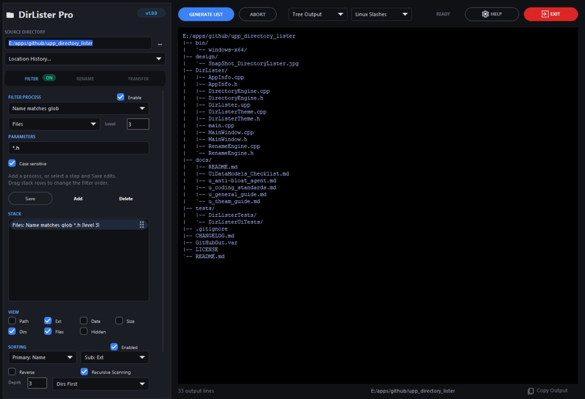

# DirLister 1.0.1

A native Windows desktop tool for filtering a directory, generating readable
listings, previewing batch renames, and copying the selected files and folders.
Built with U++ and `upp_Ui`.



## Run

Launch [bin/windows-x64/DirLister.exe](bin/windows-x64/DirLister.exe).
This folder contains the latest Windows x64 Release build.

## Repository layout

| Folder | Contents |
| --- | --- |
| `bin/windows-x64` | Latest application executable |
| `DirLister` | Main U++ package and C++ source |
| `docs` | Development guidance |
| `design` | Screenshots and design references |
| `tests` | Focused engine and native UI regression packages |

Compiler caches, fixtures, test executables and temporary reports belong in the
system temporary directory, outside the checkout.

## Quick start

1. Choose a **Source Directory**.
2. In **Filter**, choose a process, fill its parameters, and click **Add**.
3. Set **Scan depth limit** below Location History; View and Sorting sit below the stack.
4. Click **Generate List**, and choose Text, Tree, CSV or JSON output.
5. Use **Rename** or **Transfer** when you want to act on that selection.

**Help** opens a scrolling guide with step-by-step filter and rename recipes.
Generate List is a preview. Apply Rename and Apply Transfer ask for confirmation
before making filesystem changes.

## Two stacks, one workflow

The Filter stack chooses entries; the Rename stack transforms their names.
Both use a process dropdown, process-specific parameters, **Add**, **Save**,
**Delete**, and row handles for drag reordering. Select a row to edit it and Save
before applying; changing parameters alone does not replace the saved step.
Steps run from top to bottom. Rename and Transfer share the filtered working set.

## Filter processes

| Process | Purpose |
| --- | --- |
| Name matches glob / excludes glob | Include or exclude wildcard patterns |
| Name contains / doesn't contain | Include or exclude substring matches |
| First N matches / parent | Sample matching siblings under each parent |
| Size range / Outside size range | Select file sizes inside or outside bounds |
| Modified date range / Outside modified date range | Select dates inside or outside bounds |

Each step can target Files, Directories, or both, with an optional **Apply at level**:
0 applies at every level, 1 to source children, 2 to their children, and so on.
Apply at level controls only where that rule runs; it does not limit traversal.
**Scan depth limit**, above the tabs, controls how far the scanner goes.
Size steps always target files; folder sizes are not measured. Name processes
support case sensitivity through the **Case** checkbox beside the pattern.
First N supports Glob or Contains and a **Keep** count.
Adding a step enables filtering; the Enable checkbox can bypass the entire stack.

Glob uses `*` for any sequence and `?` for one character. Separate alternatives
with `;`, such as `*.jpg;*.png`. Empty patterns match all names. Positive steps
intersect the current selection. Negative name steps prune matching directory
branches. Size/date steps filter entries without pruning branches, since children
have independent metadata. Zero size bounds and blank dates are unlimited; date
bounds are inclusive. Reversed ranges are normalized and unknown dates unaffected.

### Example: sample a large shot archive

For `I:/archive/fbb/BB_job/prod/work`, select Dirs and clear Files under View.
Enable recursion, set Scan depth limit 2, choose name sorting and **Tree Output**.
Add **First N matches / parent** with Directories, Glob `BB_*`, Apply at level 0, Keep 3.
This keeps three matching folders per parent, their selected children, and other
folder names. Keep 1 samples a single matching folder. Keep 0 skips matches.

To sample just one numeric shot folder inside each selected `BB_*` folder, add
another First N step with Directories, Glob `*`, Apply at level 3, Keep 1.
Place exclusions before First N to fill its slots from eligible names. Exclusions
after First N remove entries from the sample already chosen. Sorting controls
which matches count as first; reverse sorting reverses that choice.

### Example: recent images without temporary names

Add these Files steps in order:

1. Name matches glob: `*.jpg;*.png`.
2. Name doesn't contain: `temp;backup`.
3. Size range: Min 1, Max 0, unit MB.
4. Modified date range: From 2026-01-01, To blank.

Only images of at least 1 MB, modified on or after that date, without temp/backup
in their names remain. To take three eligible images per parent, add First N last
with Files, Glob `*`, Keep 3.

## Depth and output

Depth counts extra levels below source children: 0 lists immediate children,
1 lists two levels, and 2 lists three levels. With recursion off, only source
children appear. Hidden includes hidden entries.

- **Text** uses relative paths to distinguish identical names in different branches.
- **Tree** groups parents and children with ASCII line art. Filtered ancestors
  marked `[context]` are display context, not selected rename/transfer entries.
- **CSV** and **JSON** support spreadsheets and structured exports.

Path, Ext, Date and Size control display fields. Linux Slashes changes separators.
Copy Output copies the complete report. Large listings scroll through every row.
The scan is currently synchronous; Abort does not interrupt a running scan yet.

## Rename processes and examples

Processes include Search & Replace, Case Transform, Alphanumeric Only, Numbering,
Prefix, Extension Replace, Insert Left, and Insert Right. The preview samples
current filtered entries; sample input tests a name independently. Preview count
limits examples, not the full set that Apply Rename will operate on.

### Example: clean image names and add a project prefix

Filter Files with Name matches glob `*.jpg;*.png`, then Generate List to check the
selection. Remove unwanted existing Rename steps and add these in order:

1. Search & Replace: Find a space, Replace `_`.
2. Case Transform: lower.
3. Prefix: `project_`.

`My Image.JPG` becomes `project_my_image.jpg`. Save any edits, review several
samples, then Apply Rename and confirm. Extension Replace changes the filename;
it does not convert file contents to another format.

### Example: number a token

Filter Files with Name contains `TOKEN`. Add Numbering with Find `TOKEN`, Pattern
`####`, Start 1. With name sorting enabled, the first selected `shot_TOKEN.exr`
becomes `shot_0001.exr`; subsequent entries use 0002, 0003, and so on. Names without
the token are unchanged. Existing-name collisions can receive a numeric suffix.

### Example: understand rename order

Prefix `Project_` followed by lower case produces `project_myfile.txt`.
Lower case followed by Prefix `Project_` produces `Project_myfile.txt`.
Drag rows to choose the result and inspect the preview before applying.

For a combined workflow, Filter Files by `*.exr` and exclude Contains `temp`,
Generate List, then Rename with Prefix `final_`. The Filter stack chooses the
entries and the Rename stack changes their names. Inspect the full listing,
not just the small preview sample, before confirming.

## Transfer

Choose a target and Preserve Tree or Flatten Files. Auto-Increment keeps existing
files and chooses a new name; Overwrite Existing replaces them; Skip Existing
leaves them untouched. Verification compares copied content. Apply Transfer
confirms the target and planned entry count, then writes a report to the output.

## Build

The main package is `DirLister/DirLister.upp`. `GitHubOut.var` records this
workstation's nests and a temporary compiler output directory. Adjust dependency
paths for another workstation; the required packages are Core, Draw, CtrlCore,
CtrlLib and Ui (with its Animation dependency).

Run from the repository root:

```powershell
$repoPath = (Get-Location).Path
$nests = "$repoPath,E:/apps/github/upp_Ui,E:/apps/github/upp_animation,E:/upp-18468/uppsrc"
$cachePath = Join-Path $env:TEMP 'DirLister-umk'
New-Item -ItemType Directory -Force bin/windows-x64 | Out-Null
& E:/upp-18468/umk.exe $nests DirLister CLANGx64 --out-dir $cachePath -br +GUI "$repoPath/bin/windows-x64/DirLister.exe"
if ($LASTEXITCODE) { throw 'Build failed' }
```

`bin/windows-x64` stays limited to the application; UMK intermediates live in the
external cache. Debug and Release BLITZ builds are supported and verified here.

## Regression checks

The useful checks are grouped under `tests`, with generated output in
`$env:TEMP/DirLister-tests`. Build `tests/DirListerTests` and run it first; it creates
the fixtures and checks depth, sorting, names, sizes, dates, tree output and limits.
Then build `tests/DirListerUiTests` to check large-list scrolling, draft isolation,
Add/Save/Delete and drag reorder using the actual native controls.

Use the same nests and external cache as above, with output paths in the temporary
directory rather than `bin`. Native checks run without a visible application
window and save their report and control renders alongside the temporary fixtures.
The optional archive scan is read-only. Live keyboard/mouse acceptance remains a
separate check from native rendering and control-state validation.

See [CHANGELOG.md](CHANGELOG.md) for dated releases.
